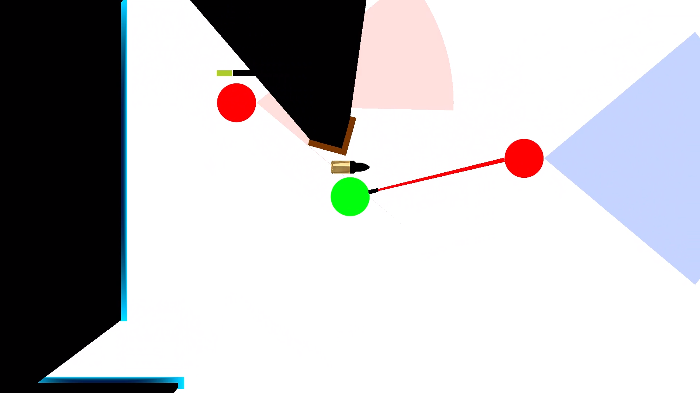
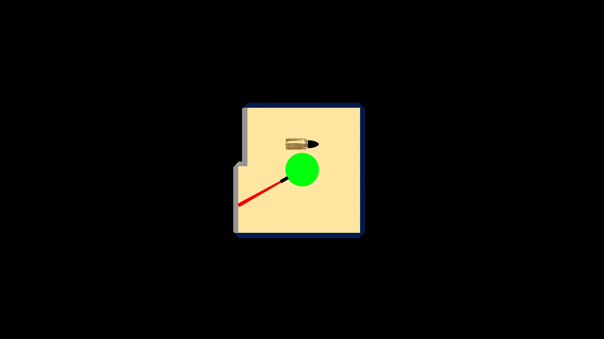
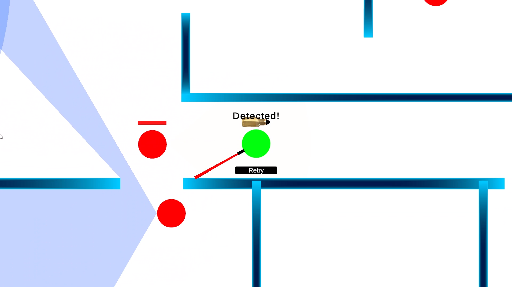

# No Line of Sight

A stealth game developed in Unity where the player must avoid enemy visions and navigate between floors without being detected

## Demo video

https://youtu.be/Jp0Z48Dc5nU

## Preview

## Features

- Multi-floor level design connected by elevators  
- Raycasted cone of vision based detection system  
- Dynamic visibility check with obstacles blocking the vision  
- Stencil buffer based visibility rendering  
- Loading screen free transition between floors  
- Automatic encrypted save  
- Custom shaders  
- Patrolling enemy AI  

## Technical Highligts

### Vision system

Both the player and the enemies use the same raycast based vision cone component - with different vision angles. 
The player's vision's mesh is using a shader that writes the stencil buffer. A full-screen black quad is rendered on top of everything after performing a stencil test, creating the effect of a vision mask.

### Floor transition

Taking advantage of the vision mask, the loading of the floors happens while the player is inside the elevator between the floors

### Saving the game

The game progress is automatically saved into an encrypted save file at the beginning of each floor

### Detection system

The guards don't just detect the player, they also detect dead guards or anything that implements the IDetectable interface

## Controls

- Movement - WASD  
- Slide - SPACE  
- Shoot - Left mouse button  
- Reload - R  
- Interact with the elevator - E  
- Pause - ESC
